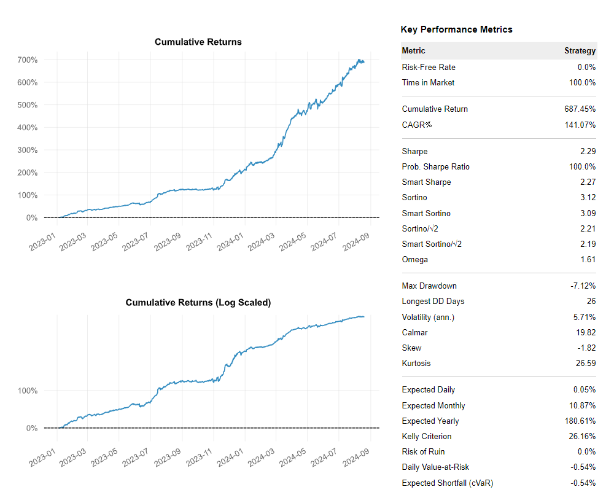
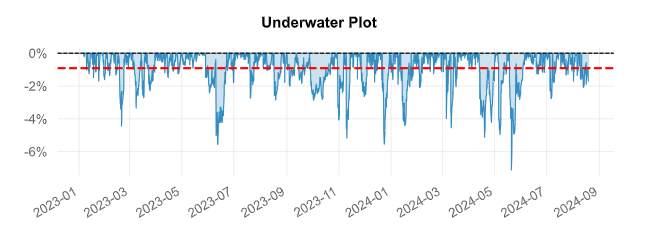

# Copula-Based Pairs Trading with Mispricing Index and Bollinger Bands
## Overview
This project implements a Copula-Based Pairs Trading strategy that utilizes a Mispricing Index and Bollinger Bands to identify and exploit arbitrage opportunities in financial markets. The objective is to construct a statistical arbitrage strategy by detecting and trading on price discrepancies between two co-integrated assets.

## Features
- **Copula Modeling**: Uses copula models to capture the dependency structure between pairs of assets, allowing for more flexible modeling of joint distributions compared to traditional linear methods.
-**Mispricing Index**: Calculates a Mispricing Index to quantify the divergence of asset prices from their expected equilibrium. This index serves as the primary signal for initiating trades.
-**Bollinger Bands**: Employs Bollinger Bands to assess volatility and identify mean-reversion opportunities, complementing the Mispricing Index.
-**Pairs Selection**: Implements a selection process to identify pairs of assets that are likely to be co-integrated, enhancing the robustness of the strategy.
-**Backtesting**: Includes backtesting capabilities to evaluate the historical performance of the trading strategy, with metrics such as Sharpe ratio, drawdown, and cumulative returns.
## Getting Started
### Prerequisites
-**Required Python packages**
  - **Clone the repository**:
   ```bash
pip install -r requirements.txt
   ```

## Usage
1.**Data Preparation**: Prepare your dataset of historical prices for the assets you want to analyze. The data should be in CSV format with columns for Date, Asset 1, and Asset 2 prices.
2.**Pairs Selection**: Run the pairs selection module to identify co-integrated pairs from the dataset.
3.**Modeling**: Fit the copula model to the selected pairs and compute the Mispricing Index.
4.**Trading**: Use the Mispricing Index and Bollinger Bands to generate trading signals, and backtest the strategy using historical data.

## Project Structure

- `main.py`: Entry point of the project.
- `data/`: Directory to store input data files.
- `models/`: Contains the implementation of copula models, Mispricing Index calculations, and Bollinger Bands.
- `backtesting/`: Module for backtesting the trading strategy.
- `examples/`: Example scripts demonstrating the usage of the project.
- `requirements.txt`: List of required Python packages.
  
## Results
Results of the strategy, including performance metrics and visualizations, are saved in the `results/` directory. The output includes:


- **Trade Log**: A detailed log of all trades executed during the backtest.
- **Performance Metrics**: Key performance indicators like Sharpe ratio, maximum drawdown, and win/loss ratio.
-  
 - **Drawdown**: Visualizes the drawdown over the backtesting period.
   

## Contact

For any inquiries or issues, please contact:

- **Name**: SALOMON Thomas
- **Email**: [your.email@example.com](mailto:thomas.salomon@ensae.fr)
- **GitHub**: [yourusername](https://github.com/yourusername)

